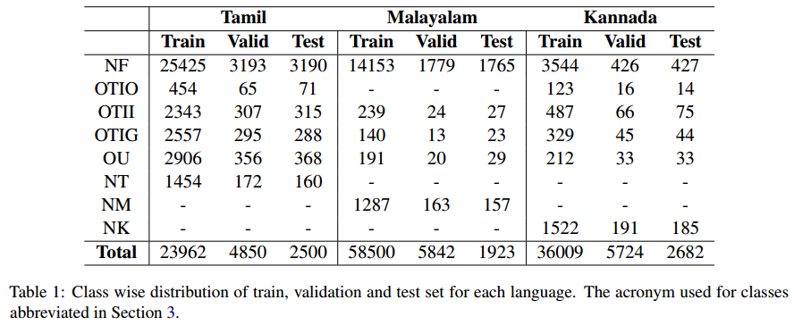
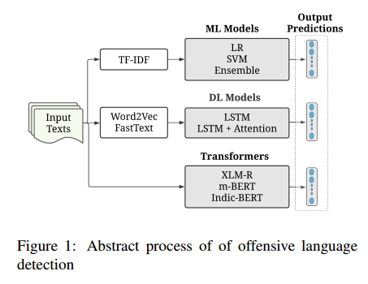
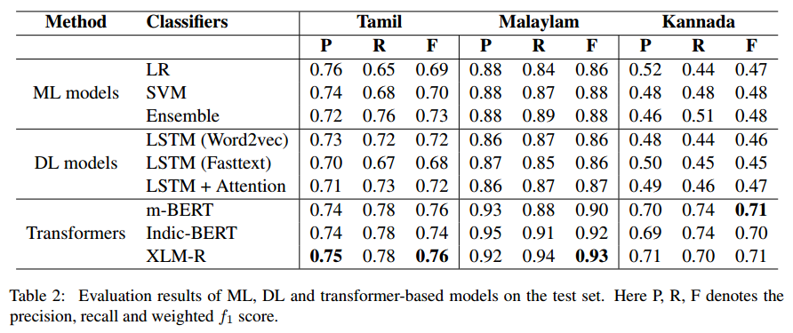
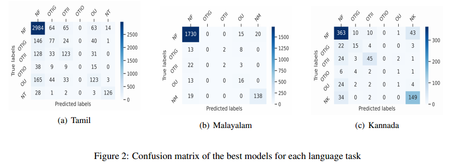
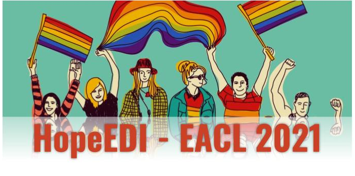
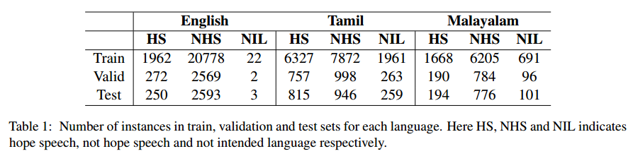
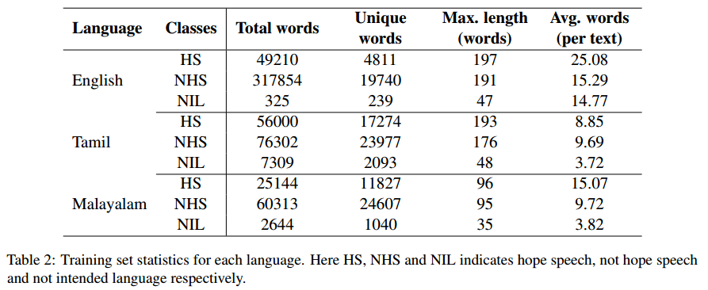
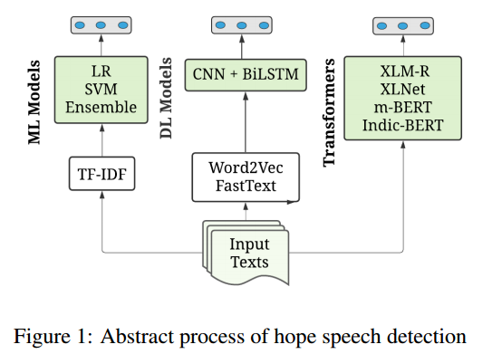
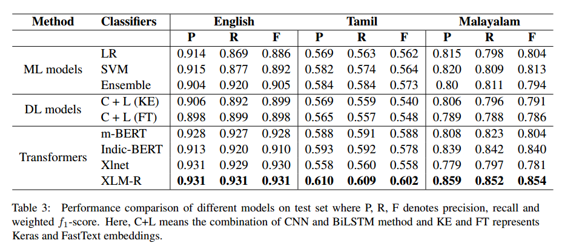
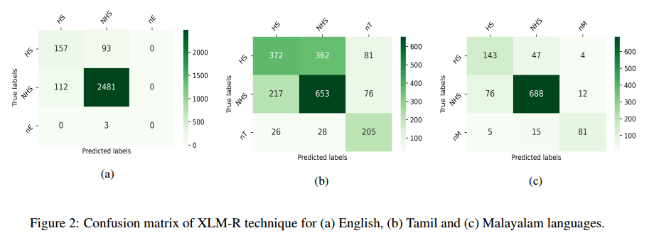

# EACL-2021

`Code and dataset of the tasks are released here. In order to use the dataset interested ones have to follow policy of workshop organizers`

# Shared Task#1

## Offensive Language Detection from Multilingual Code-Mixed Text using Transformers

**Author:** Omar , Eftekhar Hossain, and Mohammed Moshiul Hoque

**Venue:** Shared task description paper of DravidianLangTech workshop collocated with EACL-2021. [DravidianLangTech@EACL2021](https://dravidianlangtech.github.io/2021/index.html)

**Paper Link:** [https://arxiv.org/abs/2103.00455](https://arxiv.org/abs/2103.00455)
## Abstract

The increasing accessibility of the internet facilitated social media usage and encouraged individuals to express their opinions liberally. Nevertheless, it also creates a place for content polluters to disseminate offensive posts or contents. Most of such offensive posts are written in a cross-lingual manner and can easily evade the online surveillance systems. This paper presents an automated system that can identify offensive text from multilingual code-mixed data. In the task, datasets provided in three languages including Tamil, Malayalam and Kannada code-mixed with English where participants are asked to implement separate models for each language. To accomplish the tasks, we employed two machine learning techniques (LR, SVM), three deep learning (LSTM, LSTM+Attention) techniques and three transformers (m-BERT, Indic-BERT, XLM-R) based methods. Results show that
XLM-R outperforms other techniques in Tamil and Malayalam languages while m-BERT achieves the highest score in the Kannada language. The proposed models gained weighted f-1 score of 0.76 (for Tamil), 0.93 (for Malayalam), and 0.71 (for Kannada) with a ***rank of 3rd, 5th and 4th respectively***.

## Contribution
- Prepared transformer-based methods to identify the offensive texts from multilingual (Tamil, Malayalam, Kannada) code-mixed data.
- Perform experiments on the dataset with detail performance and error analysis, thus setting an important baseline to compare in future.

## Dataset Analysis

The number of instances used to train, validate and test the models summarized in table 1.

## System Overview
Figure 1 presents the schematic diagram of our system, which has three major phases: preprocessing, feature extraction and classification.

## Results 
Table 2 presents the evaluation results of the tasks on the test set.

Figure 2 presents the confusion matrices of the best model for each language.

## Conclusion
In this work, we have described and analyzed the system’s performance implemented as a participation in the offensive language identification shared task at EACL-2021. Initially, SVM, LR, LSTM, LSTM+Attention models have employed with tf-idf and word embedding features. Results indicate that ML ensemble achieved higher accuracy than DL methods. However, the outcomes are not promising for the available datasets. Code-mixing of multilingual texts might be a reason behind this. We applied transformer-based models to overcome this situation, which provides an astonishing rise in accuracy than ML and DL-based methods. Weighted f-1 score increased from 0.73 to 0.76, 0.88 to 0.93 and 0.48 to 0.71 for Tamil, Malayalam and Kannada language respectively. In future, the idea of ensemble technique could be adopted on transformer-based models to investigate the system’s overall performance.In this work, we have described and analyzed the system’s performance implemented as a participation in the offensive language identification shared task at EACL-2021. Initially, SVM, LR, LSTM, LSTM+Attention models have employed with tf-idf and word embedding features. Results indicate that ML ensemble achieved higher accuracy than DL methods. However, the outcomes are not promising for the available datasets. Code-mixing of multilingual texts might be a reason behind this. We applied transformer-based models to overcome this situation, which provides an astonishing rise in accuracy than ML and DL-based methods. Weighted f-1 score increased from 0.73 to 0.76, 0.88 to 0.93 and 0.48 to 0.71 for Tamil, Malayalam and Kannada language respectively. In future, the idea of ensemble technique could be adopted on transformer-based models to investigate the system’s overall performance.
#

# Shared Task#2

## Multilingual Code-Mixed Hope Speech Detection using Cross-lingual Representation Learner

**Author:** Eftekhar Hossain, Omar Sharif, and Mohammed Moshiul Hoque

**Venue:** Shared task description paper of LT-EDI workshop collocated with EACL-2021. [LT-EDI@EACL2021](https://sites.google.com/view/lt-edi-2021/home)

**Paper Link:** [https://arxiv.org/abs/2103.00464](https://arxiv.org/abs/2103.00464)

## Abstract

In recent years, several systems have been developed to regulate the spread of negativity and eliminate aggressive, offensive or abusive contents from the online platforms. Nevertheless, a limited number of researches carried out to identify positive, encouraging and supportive contents. In this work, our goal is to identify whether a social media post/comment contains hope speech or not. We propose three distinct models to identify hope speech in English, Tamil and Malayalam language to serve this purpose. To attain this goal, we employed various machine learning (support vector machine, logistic regression, ensemble), deep learning (convolutional neural network + long short term memory) and transformer (m-BERT, Indic-BERT, XLNet, XLM-Roberta) based methods. Results indicate that XLM-Roberta outdoes all other techniques by gaining a weighted f1-score of 0.93, 0.60 and 0.85 respectively for English, Tamil and Malayalam language. ***Our team has achieved 1st, 2nd and 1st rank in these three tasks respectively.***

## Contribution
- Develop a model with cross-lingual contextual word embeddings (i.e. transformers) to identify the hope speech considering the codemixed data for English, Tamil and Malayalam languages.
- Investigated the superiority of various ML, DL and transformer-based techniques with detail experimentation.

## Dataset Analysis

The number of instances used to train, validate and test the models summarized in table 1.

Table 2 represents the training set statistics.

## System Overview
Figure 1 presents the schematic diagram of our system, which has three major phases: preprocessing, feature extraction and classification.

## Results 
Table 3 presents the evaluation results of the tasks on the test set.

Figure 2 presents the confusion matrices of the best models.

## Conclusion
This paper describes and analyses the several ML, DL, and transformer-based methods that we have adopted to participate in the hope speech detection shared task at EACL 2021. Employing TFIDF, embedding features initially, we performed experiments with ML (LR, SVM, ensemble) and DL (CNN+BiLSTM) approaches. The outcome shows that the ensemble technique achieved higher performance compared to other ML/DL models. Further, transformer-based techniques are employed to improve the overall performance. The XML-R model outperformed all the models performance by achieving the highest weighted f1-score of 0.931, 0.854, and 0.602 respectively for English, Tamil Malayalam language. In the future, contextualized embeddings (such as ELMO, FLAIR) and transformers ensemble might explore to investigate the system’s performance.

## Ackonwlegement
All the works are supported and funded by [CUET NLP Lab](https://cuetnlp.com/). Besides, we are thanking to [Prof. Dr. Mohammed Moshiul Hoque](https://www.researchgate.net/profile/Moshiul_Hoque) for his valuable guidance.

## Note
`If you find any anomaly or have any query/suggestion feel free to ping.`

